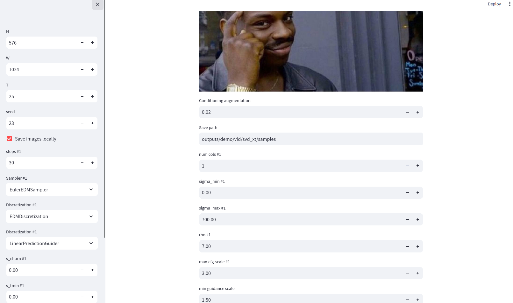

# A dockerized build of stable-diffusion-video-img2vid model

Main changes compared to the upstream repo:

* CUDA 12.x support
* all the dependencies like ffmpeg are pre-installed in the container
* the low-VRAM mode (which is loading the model in 16-bit) is enabled by default: it can run fine on 24 Gb VRAM hardware.

The build is published on Docker Hub: https://hub.docker.com/r/shutty/sdv-img2txt


## Running the container

Use the following command to run the container:

```bash
docker run -p 8501:8501 --gpus all \
  -v /home/shutty/.cache:/root/.cache \
  -v $PWD/checkpoints:/app/checkpoints \
  -i -t shutty/sdv-img2txt:latest
```

Some notes regarding arguments being used here:

* `/app/checkpoints` volume: The docker image published to Hub does not bundle the model files due to their size, you need to download
[svd.safetensors](https://huggingface.co/stabilityai/stable-video-diffusion-img2vid) and [svd_xt.safetensors](https://huggingface.co/stabilityai/stable-video-diffusion-img2vid-xt) files from huggingface and put them into this volume.
* `/root/.cache` volume: the SDV model itself depends on the OpenCLIP model, which is downloaded automatically during startup. If you don't want
to pull 3Gb from internet each time you start the container - pass a cache.
* `--gpus all`: this thing will work only with a modern GPU with at least 24Gb VRAM
* `-p 8501:8501`: the port used by the Streamlit web UI


The `/app/checkpoints` should look like this:

```
/checkpoints $ ls -la

total 18671168
drwxr-xr-x  2 shutty shutty       4096 Nov 27 15:25 .
drwxr-xr-x 15 shutty shutty       4096 Nov 30 13:36 ..
-rw-r--r--  1 shutty shutty 9559625980 Nov 21 19:41 svd.safetensors
-rw-r--r--  1 shutty shutty 9559625980 Nov 21 19:45 svd_xt.safetensors

```

Yes, both models are 9.5GB.

## Streamlit UI and low-VRAM mode



The UI supports two models:

* SVD, which emits 7 frames.
* SVD-XT, which emits 24 frames.

There are plenty of config knobs in the UI, but we suggest to focus on the following ones:

* `steps #` the more steps, the longer the rendering, but less genai artifacts.
* `Decode t frames at a time` - set to at max 4 to fit into 24GB VRAM.

## License

Apache 2.0